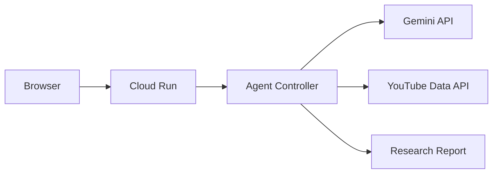

# CommentAgent

**YouTubeの「みんなの声」を、AIエージェントが横断調査するWebアプリ。**

知りたいテーマを入力すると、CommentAgentが調査計画を作り、YouTube動画を検索し、コメントを収集・分析します。分析対象が不足していると判断した場合は検索語を組み直して追加調査します。

## 主な機能

- Geminiによる調査計画の作成
- YouTube Data API v3による動画検索とコメント収集
- 複数動画を横断した感情・論点・代表意見の分析
- `Plan → Act → Observe → Reflect → Re-plan` のエージェントループ
- Agent Activityによる判断過程の可視化
- 追加調査をユーザーが許可／禁止できる制御
- Cloud Run対応のDocker構成

## 構成



## ローカル起動

Node.js 20以上が必要です。

```bash
cp .env.example .env
# .envにYOUTUBE_API_KEYとGEMINI_API_KEYを設定
npm install
npm start
```

`http://localhost:8080` を開きます。`GEMINI_API_KEY`が未設定の場合、コメント収集後に簡易集計を表示します。

## テスト

```bash
npm test
```

## Google Cloudへデプロイ

### 1. APIを有効化

```bash
gcloud services enable run.googleapis.com cloudbuild.googleapis.com artifactregistry.googleapis.com secretmanager.googleapis.com youtube.googleapis.com
```

### 2. Artifact RegistryとSecret Managerを準備

```bash
gcloud artifacts repositories create comment-agent --repository-format=docker --location=asia-northeast1
printf '%s' 'YOUR_YOUTUBE_KEY' | gcloud secrets create YOUTUBE_API_KEY --data-file=-
printf '%s' 'YOUR_GEMINI_KEY' | gcloud secrets create GEMINI_API_KEY --data-file=-
```

Cloud BuildサービスアカウントとCloud Run実行サービスアカウントに、必要最小限のSecret Manager Secret Accessor権限を付与してください。

### 3. ビルド・デプロイ

```bash
gcloud builds submit --config cloudbuild.yaml --region=asia-northeast1
```

継続デプロイを使う場合は、Google CloudコンソールのCloud Build「リポジトリ」から本リポジトリを接続し、`main`へのpushをトリガー、構成ファイルを `cloudbuild.yaml` に設定します。

## 環境変数

| 変数 | 必須 | 説明 |
|---|---:|---|
| `YOUTUBE_API_KEY` | Yes | YouTube Data API v3キー |
| `GEMINI_API_KEY` | Yes | Gemini APIキー |
| `GEMINI_MODEL` | No | 既定値 `gemini-2.5-flash` |
| `MAX_VIDEOS` | No | 1回に扱う最大動画数（既定6） |
| `MAX_COMMENTS_PER_VIDEO` | No | 動画ごとの最大コメント数（既定100） |
| `MAX_AGENT_ROUNDS` | No | 調査ラウンド上限（既定2、最大3） |

## セキュリティと制御

- APIキーはブラウザへ渡さず、Cloud Runの環境変数またはSecret Managerで管理します。
- 調査ラウンド・動画数・コメント数にはサーバー側上限があります。
- YouTube検索はSafeSearchを有効化しています。
- AIの総評は「取得したコメント内の傾向」であり、世論全体を表すものではありません。

## ハッカソンでの新規開発範囲

元になったClaude Code Skill `YouTubeCommentSummary` の知見を活かしつつ、本リポジトリではWeb UI、HTTP API、Geminiエージェントループ、追加調査、可観測性、Cloud Run構成を新規開発しています。

## License

MIT
