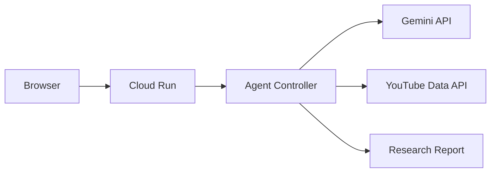

# CommentAgent

**YouTubeの「みんなの声」を、AIエージェントが横断調査するWebアプリ。**

知りたいテーマを入力すると、CommentAgentが調査計画を作り、YouTube動画を検索し、コメントを収集・分析します。分析対象が不足していると判断した場合は検索語を組み直して追加調査します。

## 主な機能

- Geminiによる調査計画の作成
- YouTube Data API v3による動画検索とコメント収集
- 複数動画を横断した感情・論点・代表意見の分析
- `Plan → Act → Observe → Reflect → Re-plan` のエージェントループ
- Agent Activityによる判断過程の可視化
- 追加調査をユーザーが許可／禁止できる制御
- Cloud Run対応のDocker構成

## 構成



## ローカル起動

Node.js 20以上が必要です。

```bash
cp .env.example .env
# .envにYOUTUBE_API_KEYとGEMINI_API_KEYを設定
npm install
npm start
```

`http://localhost:8080` を開きます。`GEMINI_API_KEY`が未設定の場合、コメント収集後に簡易集計を表示します。

## テスト

```bash
npm test
```

## Google Cloudへデプロイ

このリポジトリの既定プロジェクトは `jumpeicloud`、リージョンは東京の `asia-northeast1` です。Google Cloud ConsoleでCloud Shellを開き、リポジトリを取得して作業します。

```bash
git clone https://github.com/KickboxerJ0322/CommentAgent.git
cd CommentAgent
gcloud config set project jumpeicloud
```

### 1. APIを有効化

```bash
gcloud services enable run.googleapis.com cloudbuild.googleapis.com artifactregistry.googleapis.com secretmanager.googleapis.com youtube.googleapis.com
```

### 2. Artifact RegistryとSecret Managerを準備

```bash
gcloud artifacts repositories create comment-agent --repository-format=docker --location=asia-northeast1
```

#### Secretの登録

APIキーをコマンド履歴やGitHubへ残さないよう、Cloud Shell上で値を非表示入力して登録します。

```bash
read -rsp 'YouTube API key: ' YT_KEY && echo
printf '%s' "$YT_KEY" | gcloud secrets create YOUTUBE_API_KEY --data-file=-
unset YT_KEY

read -rsp 'Gemini API key: ' GM_KEY && echo
printf '%s' "$GM_KEY" | gcloud secrets create GEMINI_API_KEY --data-file=-
unset GM_KEY
```

すでにSecretが存在する場合は、`versions add` で新しいバージョンを登録します。

```bash
read -rsp 'YouTube API key: ' YT_KEY && echo
printf '%s' "$YT_KEY" | gcloud secrets versions add YOUTUBE_API_KEY --data-file=-
unset YT_KEY
```

Cloud BuildサービスアカウントとCloud Run実行サービスアカウントに、必要最小限のSecret Manager Secret Accessor権限を付与してください。

### 3. ビルド・デプロイ

```bash
bash scripts/deploy.sh
```

スクリプトはAPI有効化、Artifact Registry作成、Secret存在確認、Cloud Build、Cloud Run URL表示を順番に行います。既存のArtifact RegistryやSecretを削除・上書きしません。

継続デプロイを使う場合は、Google CloudコンソールのCloud Build「リポジトリ」から本リポジトリを接続し、`main`へのpushをトリガー、構成ファイルを `cloudbuild.yaml` に設定します。

## 環境変数

| 変数 | 必須 | 説明 |
|---|---:|---|
| `YOUTUBE_API_KEY` | Yes | YouTube Data API v3キー |
| `GEMINI_API_KEY` | Yes | Gemini APIキー |
| `GEMINI_MODEL` | No | 既定値 `gemini-3.6-flash` |
| `MAX_VIDEOS` | No | 1回に扱う最大動画数（既定6） |
| `MAX_COMMENTS_PER_VIDEO` | No | 動画ごとの最大コメント数（既定100） |
| `MAX_AGENT_ROUNDS` | No | 調査ラウンド上限（既定2、最大3） |

## セキュリティと制御

- APIキーはブラウザへ渡さず、Cloud Runの環境変数またはSecret Managerで管理します。
- 調査ラウンド・動画数・コメント数にはサーバー側上限があります。
- YouTube検索はSafeSearchを有効化しています。
- AIの総評は「取得したコメント内の傾向」であり、世論全体を表すものではありません。

## ハッカソンでの新規開発範囲

元になったClaude Code Skill `YouTubeCommentSummary` の知見を活かしつつ、本リポジトリではWeb UI、HTTP API、Geminiエージェントループ、追加調査、可観測性、Cloud Run構成を新規開発しています。

## License

MIT
